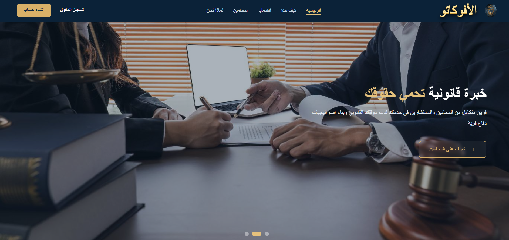
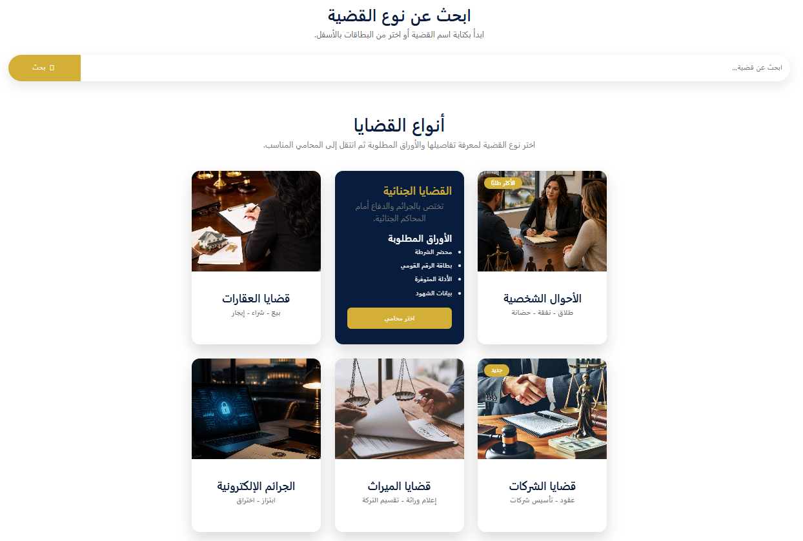
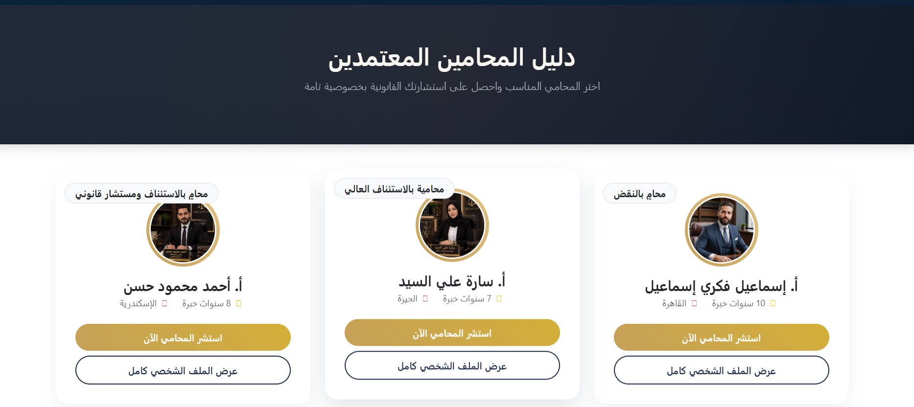
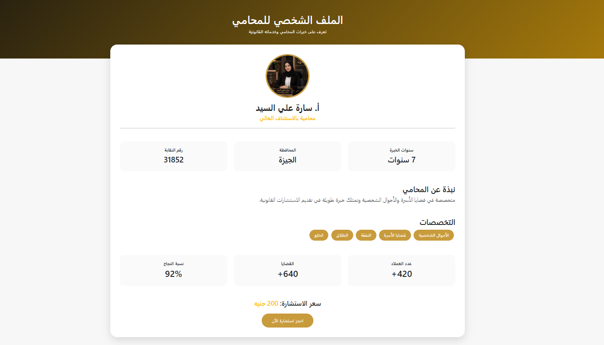
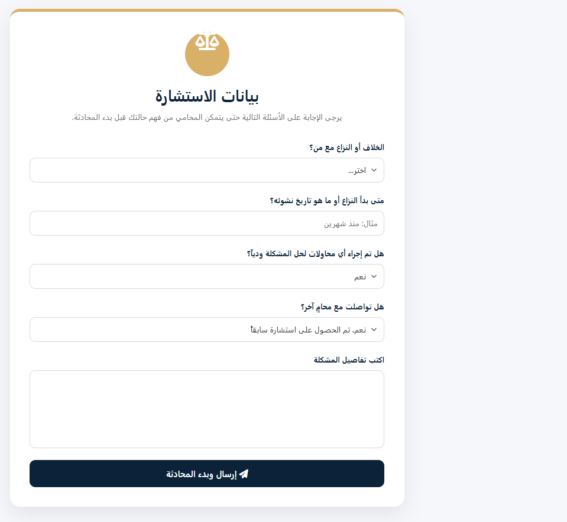
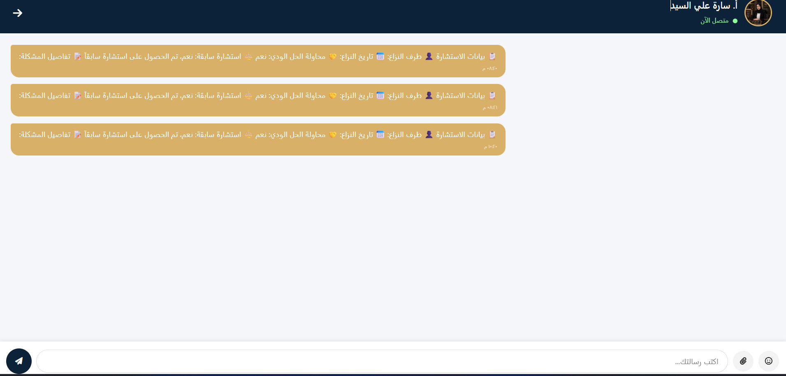

# ⚖️ Al-Avokato

**A legal-tech platform connecting clients with verified lawyers, making legal consultations simple and secure.**


---

## 📖 About the Project

**Al-Avokato** is a complete legal-tech platform that bridges the gap between clients and specialized lawyers by:

- Providing a directory of verified lawyers with their specialties and experience.
- Categorizing cases (personal status, criminal, real estate, etc.) and listing the required documents for each type before starting a consultation.
- Offering a consultation booking system that first collects the case details from the client, so the lawyer understands the situation before the chat begins.
- Enabling a live chat between the client and the lawyer directly on the platform.

---

## 📸 Screenshots

| Home | Cases |
|---|---|
|  |  |

| Lawyer Directory | Lawyer Profile |
|---|---|
|  |  |

| Consultation Form | Live Chat |
|---|---|
|  |  |

---

## ✨ Key Features

| Feature | Description |
|---|---|
| 🔐 Login / Sign Up | Two separate account types (client / lawyer) with independent credentials |
| 📂 Case Categories | Browse case types with details and required documents |
| 👨‍⚖️ Lawyer Directory | Cards for verified lawyers (specialty - years of experience - governorate) |
| 🪪 Lawyer Profile | Bar registration number, success rate, number of cases and clients, consultation fee |
| 📝 Consultation Form | A short questionnaire about the dispute details before starting the chat |
| 💬 Live Chat | Instant communication between client and lawyer |
| 🌙 Arabic UI (RTL) | Fully Arabic interface, mobile-responsive |

---

## 🗂️ Project Structure

```
al-avokato/
│
├── css/                     # Stylesheets (Bootstrap + custom styles)
├── img/                     # Lawyer photos and icons
├── js/                      # JavaScript files
│
├── index.html               # Homepage
├── consultation.html        # Case type selection page
├── consultation-form.html   # Consultation details form
├── lawyer-profile.html      # Lawyer's personal profile page
└── style.css                # Global site styling
```

---

## 🧭 Site Pages

1. **Home (index.html):** Platform introduction + "How to Start?" section (4 steps) + "Why Al-Avokato?" section.
2. **Cases (consultation.html):** Search and select a case type (real estate - criminal - personal status...) along with the required documents.
3. **Lawyer Directory:** Display cards for verified lawyers with options to consult or view their full profile.
4. **Lawyer Profile (lawyer-profile.html):** Detailed info (bar number, experience, specialties, success rate, consultation fee).
5. **Consultation Form (consultation-form.html):** A questionnaire that collects dispute details before the chat starts.
6. **Live Chat:** Chat between the client and the selected lawyer.
7. **Login / Sign Up:** Separate forms for logging in and creating a new account (client / lawyer).

---

## 🛠️ Tech Stack

- **HTML5** for page structure
- **CSS3 + Bootstrap** for styling and responsive design
- **JavaScript** for interactivity (forms, chat, dropdowns)

---

## 🚀 Running Locally

1. Clone the project from GitHub:
   ```bash
   git clone https://github.com/USERNAME/al-avokato.git
   ```
2. Move into the project folder:
   ```bash
   cd al-avokato
   ```
3. Open `index.html` directly in your browser, or run the project using the Live Server extension in VS Code.

---

## 🗺️ User Flow

1. The client selects the case type from the Cases page.
2. They review the case details and required documents.
3. They choose the right lawyer from the Lawyer Directory.
4. They fill out the consultation details form.
5. They start a live chat with the lawyer to complete the consultation.

---

## 📌 Roadmap

- [ ] Connect the forms to a real database (Backend)
- [ ] Online payment system for consultation fees
- [ ] Lawyer dashboard for managing cases and clients
- [ ] Real client ratings and reviews
- [ ] Instant notifications for new chat messages
